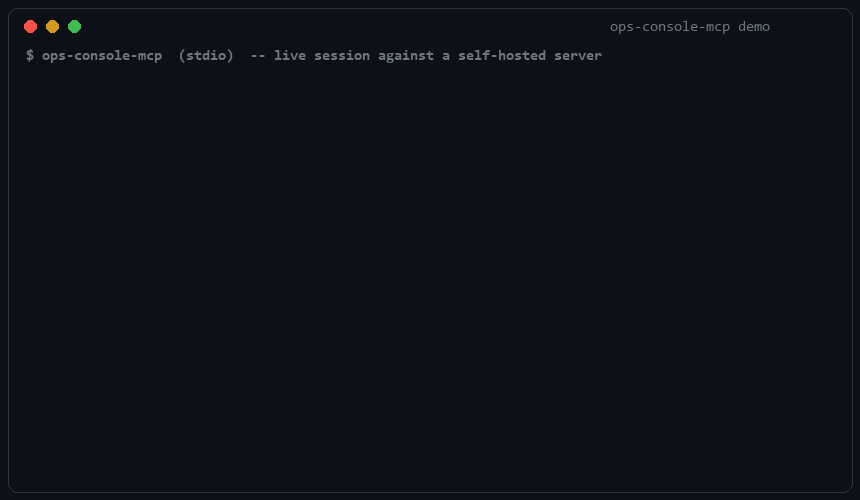

# ops-console-mcp

A read-only MCP server that gives an agent governed access to the operational state of a
self-hosted infrastructure (Docker services, backups, deploys, CI) — security-first by
construction.

## Why

The point of this project is not the feature list, it's the governance model: least privilege
at every layer, a synchronous audit trail for every call, and no write path anywhere in the
codebase. Any read-only status server can show you a container's state; the interesting part
here is *how* it is made structurally impossible for a compromised or misled agent to do
anything else.

## Demo



Rendered from a real end-to-end session: live container/deploy state, a closed-enum
rejection of a hostile argument, the absence of any write tool, and an externally
verified audit hash chain.

## Architecture

```
 ┌──────────────────────┐   stdio    ┌────────────────────────────┐
 │   MCP client          │◀──────────▶│   C# MCP server             │
 │   (e.g. Claude Code)  │            │   ModelContextProtocol      │
 │   dev machine         │            │   v1.4.0 — infra_*/ci_*     │
 └──────────────────────┘            │   redaction + audit log     │
                                      └──────────────┬──────────────┘
                                                      │ HTTPS GET (private
                                                      │ mesh VPN only, never
                                                      │ a public interface)
                                                      ▼
                                      ┌──────────────────────────────┐
                                      │  Minimal snapshot file server │
                                      │  serves snapshot.json,        │
                                      │  read-only                    │
                                      └──────────────┬───────────────┘
                                                      │ reads
                                                      ▼
                                      ┌──────────────────────────────┐
                                      │  Collector (systemd timer)     │
                                      │  dedicated service account     │
                                      │  ──────────────────────────    │
                                      │  • docker compose ps/inspect   │
                                      │  • backup service journal      │
                                      │  • ops scripts log+exit files  │
                                      │    (static whitelist)          │
                                      │  • GitHub API (fine-grained    │
                                      │    PAT, read-only scopes)      │
                                      └──────────────────────────────┘
                                        self-hosted Linux server
```

The key reason for this shape: the process with Docker access (root-equivalent on the host,
see [Security model](#security-model)) is never reachable from the network. It runs on a timer,
writes one file, and exits — it never listens on a port. The only process reachable over the
network is a minimal static file server that serves an already-redacted JSON snapshot; it never
touches Docker, systemd, or any credential. The C# MCP server itself talks to the agent over
**stdio only** — the MCP transport layer has no network surface at all, and it never contacts
the monitored host directly either: it only fetches the pre-generated snapshot.

## Tool catalog

All tools are read-only and take no free-form input: every parameter is validated against a
closed enum, a bounded integer range, or a conservative regex (git ref names). None of them
accept a repository, hostname, or file path as an argument.

| Tool | Description | Notes |
|---|---|---|
| `infra_list_services` | Lists known Docker Compose projects and container state/health. | No parameters; state read exclusively via the Docker Engine, never via systemd (some services only exist as containers). |
| `infra_get_service_logs` | Returns the last N lines of log for one container. | `service` is a closed enum (`caddy`, `web`, `postgres`); `lines` capped at 500; every line passes through the redactor. |
| `infra_get_last_backup_status` | Outcome, timestamp and duration of the last backup run. | No parameters; last run only, no history. |
| `infra_get_last_deploy_status` | Outcome and exit code of the last deploy. | No parameters; read from a fixed, non-parameterized log+exit file pair. |
| `infra_get_job_result` | Outcome and exit code of a verification job. | `job` is a closed enum (`deploy`, `restore-test`, `prepush-proof`); no arbitrary file paths. |
| `ci_get_latest_run` | Latest GitHub Actions run for a known workflow. | `workflow` is a closed enum (`ci`, `docker-build`); optional `branch` is validated against a conservative git-ref regex; the repository is fixed server-side, never a tool parameter. |
| `ci_list_failed_jobs` | Failed jobs/steps for one run. | `run_id` must belong to the configured repository; runs from any other repo are rejected with the same `NOT_FOUND` used for "does not exist", to avoid a cross-repo existence oracle. Capped at 50 jobs, messages truncated at 300 chars. |
| `ci_get_runner_status` | Online/offline and busy status of the self-hosted runner(s). | No parameters; the runner's real registered name/labels are never returned, only a generic ordinal id. |

Every successful response also carries a `stale: bool` field, computed from the snapshot's own
freshness metadata, so a stale value is never silently presented as fresh.

**What this server refuses to do.** There is no tool, and no configuration flag, that restarts,
stops, or recreates a container; runs a command inside a container or on the host (`docker exec`
does not exist here); triggers, re-runs, or cancels a GitHub Actions workflow; registers or
reconfigures the self-hosted runner; modifies a config file; or writes anything at all. These
tools do not exist in the codebase — this is not a runtime check that can be bypassed, there is
simply no code path that performs a write.

## Security model

The design follows the current MCP security best practices point by point:

- **Least privilege.** The GitHub PAT used by the collector is fine-grained and scoped to a
  single repository with `actions:read` + `contents:read`. One declared trade-off: the runner
  status endpoint (`GET /repos/{owner}/{repo}/actions/runners`) is only available under the
  `Administration` (read) permission on a fine-grained PAT, broader than the `actions:read`
  scope used for run/job data — accepted because it is still read-only and still scoped to the
  single monitored repository, not because it was overlooked.
- **No token passthrough.** No tool accepts a token or credential as an argument. All upstream
  credentials (GitHub PAT, Docker group membership, the optional snapshot bearer token) are
  configured server-side and never reflected in any output.
- **Centralized output sanitization.** A single redactor function is applied to every outgoing
  string — tool output, error messages, and audit log arguments/results alike — matching known
  token formats, PEM private key blocks, connection strings with embedded credentials,
  healthcheck ping URLs (the path segment itself acts as a bearer credential), generic
  key/value-style secrets (`token=`, `password=`, `Authorization: Bearer …`), RFC1918 and CGNAT
  (`100.64.0.0/10`) private ranges plus loopback, and internal-looking hostnames. A high-entropy
  fallback redacts anything else that looks like a secret even without matching a known pattern
  — a false positive here is preferred over a leaked value.
- **Hash-chained audit log.** Every tool call appends one JSONL record (timestamp, tool name,
  redacted arguments, caller identity, SHA-256 of the redacted result, and the SHA-256 of the
  previous record) to an append-only file. The server verifies the tail of the chain at startup
  and refuses to start (fail-closed) if it doesn't check out. The file is written with no BOM
  and one JSON object per raw line specifically so it stays externally verifiable — any script
  that reads the file sequentially and re-hashes each line can confirm the chain independently of
  this codebase.
- **Rate limiting.** Independent per-session and global sliding-window limits contain both a
  single looping session and a client that opens multiple sessions to dodge the first limit.
  Throttling events are themselves written to the audit log, not silently dropped.
- **Closed-enum input everywhere.** Every tool parameter is validated against a static
  enum/range/regex; nothing is ever concatenated into a path or a command.
- **Hardened collector.** The only process with Docker access runs under a dedicated,
  non-interactive service account, with systemd sandboxing (`NoNewPrivileges`,
  `ProtectSystem=strict`, `PrivateTmp`, `MemoryDenyWriteExecute`, a `seccomp` filter, and a
  minimal `CapabilityBoundingSet`). `ProtectHome` is deliberately set to `read-only` rather than
  `true`: the log+exit files consulted for job status can live under a home directory on some
  hosts, so read access is kept while write access stays blocked everywhere under `/home`.

**Contrast case.** A previously published Postgres MCP server enforced its "read-only" mode by
inspecting incoming SQL in application code; Datadog Security Labs found a bypass that produced
a write despite the check, and the project was archived. The lesson taken here: read-only
enforcement has to sit below the application layer, not just inside it. This project applies
that lesson as three independent, overlapping controls rather than one: (1) the write code paths
were never written, so there is nothing to bypass; (2) even given an unexpected argument, the
credentials themselves (the scoped PAT, the Docker-reading service account) cannot perform a
write against the underlying systems; (3) every argument that reaches a tool is checked against a
closed enum/range before it is used for anything.

## Getting started

**Prerequisites:** .NET SDK 10 (server), Python 3.12 on the monitored Linux host (collector,
standard library only, no third-party dependency).

**Collector configuration.** Copy `collector/collector.config.example.json` to
`collector.config.json` next to it (gitignored, never commit the real file) and fill in the real
Compose project names, backup unit name, job log/exit paths, and GitHub owner/repo/workflow file
names. The GitHub PAT itself is read from the `OPS_CONSOLE_GH_PAT` environment variable, never
from the config file.

**systemd units.** `collector/systemd/ops-console-collector.service` (+ `.timer`) and
`ops-console-snapshot.service` are templates with placeholders (`{{SERVICE_USER}}`,
`{{INSTALL_DIR}}`, `{{CONFIG_PATH}}`, `{{SNAPSHOT_DIR}}`, `{{OWNER}}`, `{{REPO}}`) to render
before installing under `/etc/systemd/system/`.

**Server environment variables:**

| Variable | Required | Default | Meaning |
|---|---|---|---|
| `OPS_CONSOLE_SNAPSHOT_URL` | yes | — | Absolute URL of the read-only snapshot endpoint. |
| `OPS_CONSOLE_SNAPSHOT_TOKEN` | no | — | Optional token sent as `X-Snapshot-Token` when fetching the snapshot. |
| `OPS_CONSOLE_AUDIT_PATH` | no | `./audit.jsonl` | Path to the append-only, hash-chained audit log. |
| `OPS_CONSOLE_RATE_PER_MINUTE` | no | `30` | Per-session call budget per minute (the global budget scales with CPU count on top of this). |

**Important:** the snapshot endpoint must be exposed only on a private mesh VPN (e.g. Tailscale
or WireGuard), never on a public interface. It serves an already-redacted static file, but it is
still the only network-reachable component in the whole system and should be treated as such.

**Example MCP client configuration:**

```json
{
  "mcpServers": {
    "ops-console": {
      "command": "dotnet",
      "args": ["run", "--project", "src/OpsConsole.Mcp"],
      "env": {
        "OPS_CONSOLE_SNAPSHOT_URL": "https://<tailnet-host>:8787/snapshot.json",
        "OPS_CONSOLE_AUDIT_PATH": "/path/to/audit.jsonl"
      }
    }
  }
}
```

## Testing

```bash
dotnet test
```

```bash
cd collector
python -m unittest discover -s tests -t .
```

Coverage includes: secret redaction across all pattern categories, including CGNAT
(`100.64.0.0/10`) ranges used by mesh VPNs; audit chain integrity and tamper detection (a
deliberately corrupted record breaks verification at the expected index); input validation for
every tool (enum, range, regex rejections); and stale-snapshot detection based on
`generated_at`/`stale_after_seconds`.

## Limitations & roadmap

- **Snapshot-based, not live.** Every response reflects the last collector run, not the current
  instant. Staleness is never hidden: the `stale` field is computed from the snapshot's own
  `generated_at` and `stale_after_seconds` and included on every successful response.
- **stdio only, by choice.** The MCP transport is stdio because the client and server are
  co-located on the same development machine (see the architecture diagram above); there is no
  network transport for the MCP layer itself. Streamable HTTP is a possible future direction if
  the server ever needs to run remotely from its client.
- **Aware of, but not built against, the MCP spec revision planned for 2026-07-28** (a stateless
  core, revised handshake, and Streamable HTTP formalized as the only network transport). This
  project is built on the stable 2025-11-25 spec and the corresponding C# SDK
  (`ModelContextProtocol` 1.4.0); the stateless revision is a migration to evaluate later, not a
  target implemented here.
- **Planned improvements:** a read-only Docker socket-proxy in front of the collector (endpoint
  allowlisting as an additional layer beyond the dedicated service account) and direct
  integration with the backup healthcheck provider's API where a read-only key is available,
  instead of relying solely on the local systemd journal.

## License

MIT — see [`LICENSE`](LICENSE).
